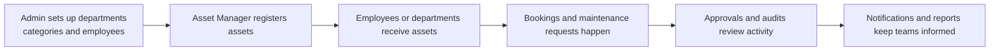
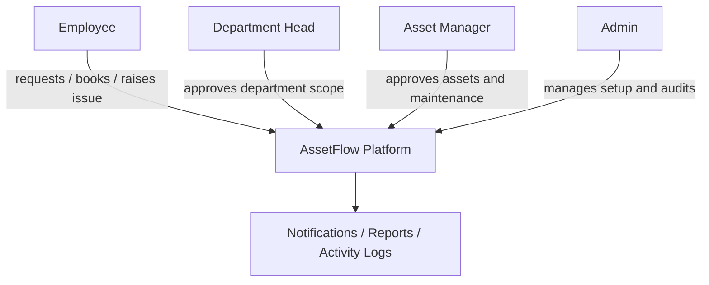
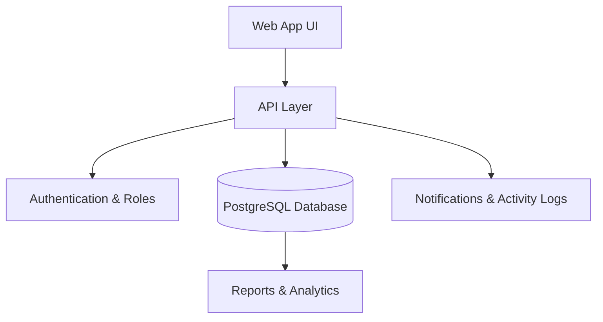

# AssetFlow

Enterprise Asset & Resource Management ERP

AssetFlow is a multi-tenant ERP-style platform for tracking physical assets, managing shared-resource bookings, coordinating approvals, and running maintenance and audit workflows. It replaces spreadsheet-heavy operations with a centralized system that gives organizations visibility into who holds what, where assets are located, and what needs attention.

## Vision

AssetFlow helps organizations of any size manage assets and shared resources through a single, role-aware system. The product is designed for environments such as offices, schools, hospitals, factories, and agencies where equipment, furniture, vehicles, rooms, and other shared resources need disciplined oversight.

The platform focuses on core operational workflows without branching into purchasing, invoicing, or accounting. Its core goals are to:

- reduce manual tracking and paper-based processes
- enforce consistent lifecycle states for assets
- prevent double-allocation and overlapping bookings
- streamline maintenance approvals and audit review
- provide notifications and analytics for overdue and high-risk activity

## Problem Statement Summary

The solution must support:

- department, category, and employee directory management
- asset registration and lifecycle tracking across states such as Available, Allocated, Reserved, Under Maintenance, Lost, Retired, and Disposed
- allocation workflows with conflict handling and transfer requests
- shared-resource booking by time slot with overlap validation
- maintenance requests routed through an approval process
- scheduled audit cycles with assigned auditors and discrepancy reporting
- dashboards, notifications, and activity logs for operations visibility

## Product Scope

### 1. Authentication and onboarding
- signup creates an Employee account only
- role selection is intentionally not available at signup
- admins promote employees to Department Head or Asset Manager from the employee directory
- login, password recovery, and session validation are part of the experience

### 2. Organization setup
Admins manage the master data that the rest of the system depends on:
- departments with optional parent/child hierarchy and department head assignment
- asset categories with optional custom metadata fields
- the employee directory with active/inactive status and role assignment

### 3. Asset lifecycle management
Assets can be registered, searched, filtered, allocated, returned, transferred, and retired. The platform tracks asset history and provides status-aware workflows.

### 4. Allocation and transfer workflows
- assets can be allocated to employees or departments
- double-allocation is blocked with a clear conflict message and a transfer option
- return flows and overdue returns are surfaced in the UI and notifications

### 5. Shared resource booking
Users can book shared resources by time slot, and the system prevents overlaps automatically.

### 6. Maintenance management
Maintenance requests move through a structured workflow before work begins, and asset status is updated accordingly.

### 7. Audit cycles
Admins create audit cycles, assign auditors, collect asset findings, and close cycles with discrepancy reporting.

### 8. Reporting and notifications
The platform provides analytics for utilization, maintenance trends, allocation summaries, booking activity, and overdue work.

## User Roles

### Admin
- manages departments, asset categories, employee roles, audit cycles, and reporting
- has organization-wide visibility

### Asset Manager
- registers and updates assets
- approves transfers, maintenance requests, and returns
- manages allocation and lifecycle changes

### Department Head
- views and approves department-scoped allocation/transfer requests
- books shared resources on behalf of the department
- sees department-focused reporting

### Employee
- views their allocated assets
- books resources
- raises maintenance requests
- initiates return and transfer requests

## Core Workflows

- asset registration creates a unique asset tag such as AF-0001
- assets transition through states such as Available, Allocated, Reserved, Under Maintenance, Lost, Retired, and Disposed
- allocation conflict handling surfaces the current holder and routes the user toward a transfer request
- maintenance approval updates asset state before repair work begins
- audit cycles assign auditors and produce discrepancy reports for flagged items
- overdue actions are surfaced through notifications and KPI views

## Technical Stack

AssetFlow is built as a modern TypeScript monorepo with a strong focus on type safety, clear boundaries, and reusable modules.

- frontend: React + TanStack Start
- backend: Elysia + oRPC
- authentication: Better Auth with tenant-aware organization support
- data layer: Prisma with PostgreSQL
- UI system: shadcn/ui + Tailwind CSS
- tooling: Bun, Turborepo, Biome, TypeScript

## How the System Works

AssetFlow is designed to be simple for business users and structured for developers. At a high level, the platform connects people, assets, and operational workflows through one shared system.

### Business flow overview



### Role-based workflow



### Architecture at a glance



## Repository Structure

```text
apps/
  web/        # frontend experience and routes
  server/     # API server and runtime
packages/
  api/        # API routers and shared business logic
  auth/       # authentication configuration
  db/         # Prisma schema, migrations, and database client
  env/        # environment helpers
  ui/         # shared UI primitives and styles
```

## Getting Started

### Prerequisites
- Bun 1.3+ recommended
- PostgreSQL running locally or through Docker

### Install dependencies

```bash
bun install
```

### Database setup

1. configure your PostgreSQL connection in the server environment settings
2. generate the Prisma client
3. apply the schema to your database

```bash
bun run db:generate
bun run db:push
```

### Run locally

```bash
bun run dev
```

The web app is served on the frontend port and the API server runs alongside it through the monorepo setup.

## Development Commands

```bash
bun run dev          # start the full stack
bun run dev:web      # start the web app only
bun run dev:server   # start the server only
bun run build        # build all workspaces
bun run check-types  # run TypeScript checks
bun run db:generate  # generate Prisma client
bun run db:push      # push schema changes to the database
bun run db:migrate   # apply Prisma migrations
bun run db:studio    # open Prisma Studio
bun run check        # run formatting and lint checks
```

## Implementation Direction

The current implementation is aligned with the PRD and problem statement in four major phases:

1. authentication, organization, and role-based access control
2. departments, categories, and employee directory setup
3. asset registration, allocation, transfer, and maintenance workflows
4. booking, audit cycles, notifications, analytics, and reporting

AssetFlow is being built as a practical ERP foundation for modern asset operations: secure, structured, and ready to evolve into a full multi-module platform.
